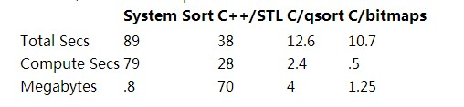

##Cracking the Oyster 

====

##题目
  如何在1MB的空间里边对10,000,000个不相同的整数排序？每个数都小于一千万，实际需要1.25MB的内存空间。

##程序设计
* 基于磁盘的归并排序

* 32位整数存储，40趟的快排

* 位图，用1千万位表示。

* 严格限制1MB：
    * 两次遍历
    * 电话号码没有0和1开头的，省略这部分。

##Column 1: Programs for sorting integers 
* [bitsort.c](Column 1/bitsort.c) -- Sort with bit vectors. 

* [sortints.cpp](Column 1/sortints.cpp) -- Sort using C++ STL sets. 

* [qsortints.c](Column 1/qsortints.c) -- Sort with C library qsort. 

* [bitsortgen.c](Column 1/bitsortgen.c) -- Generate random integers for sorting.

##习题
1.[qsort](Column 1/qsortints.c)
  [set](Column 1/sortints.cpp)

2.[bitsort](bitsort.c)

3.算法比较

4.[random data](bitsortgen.c)

5.两次遍历或者去掉无用的号码

6.采用4bit来刻录一个数

7.会忽略掉重复。用test(i)来测试是否有重复的数字。应该对输入进行检查，防止非正整数和越界的数字出现。
    注：a[-1]表示数组最开始的前一位。int *p = a[-1]; p[1] 即表示 a[0];数组下标可以从1开始了就。

8.设置区间映射表,比如800前缀有125个免费号码,找到最大的数,与最小的数,差值做为bit长度。 
  还可以用3bit表示一个号码，再多用4bit，还可以做hash成一个唯一值。

9.元素data[i]已初始化的条件是from[i]<top && to[from[i]]==i; to 和 top保证了from里边不会被写入内存随机内容
    int top = 0;
    from[i] = top;
    to[top] = i;
    data[i] = 0;
    ++top;

10.用10*10的盒子散列最后两位

11.用鸽子传照片

12.飞梭笔的由来
